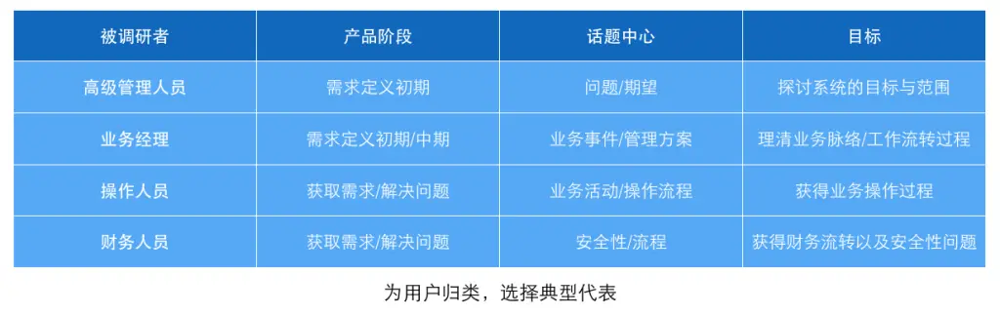
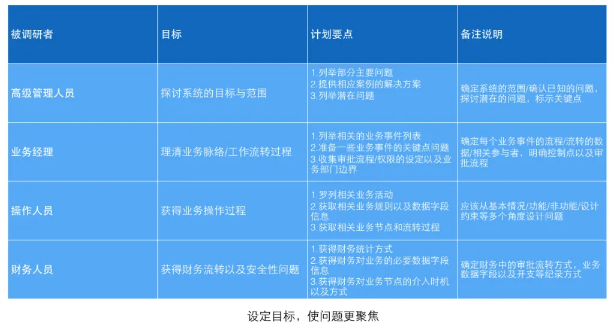
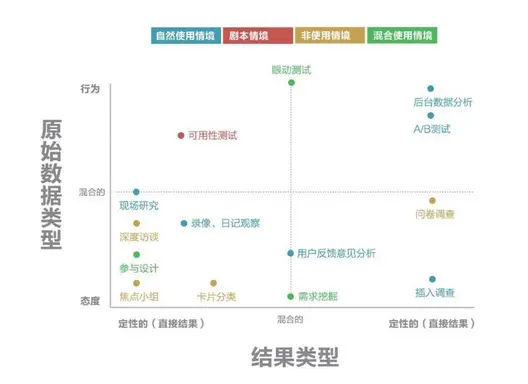
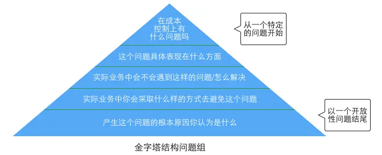
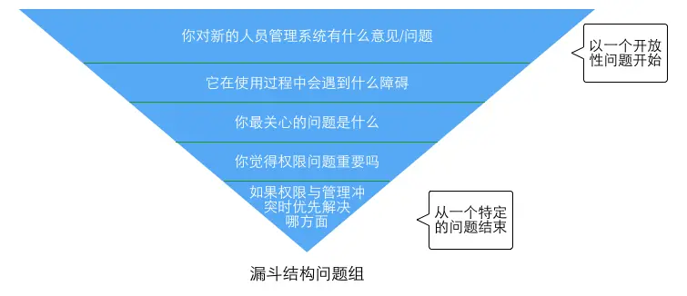
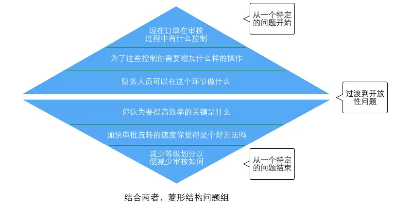

方法论｜如何做一次完美的用户调研

阿翘
关注
2016-01-14
8 评论
127459 浏览
980 收藏
12 分钟

🔗 技术知识、行业知识、业务知识等，都是B端产品经理需要了解和掌握的领域相关的知识，有助于进行产品方案设计和评估

用户调研作为产品人员最常用的工作方式，相信各位一定不会陌生。但如何提高用户调研的有效性却是一直困扰大家的问题，网上有一堆提供调研方法的文章与理论，但是却没有系统地说明如何进行一次完美的用户调研。今天我们来聊一聊用户调研到底该如何进行。

1.为用户归类，选择典型的代表
调研的最初，我们需要做的第一件事就是确定调研对象。我们在调研的时候经常会说”向对的人问对的事情”，这句话的意思是:调研不同的用户群体获得不一样的需求。根据被调研对象的不同，可以将用户分为不同的类型，企业系统常见使用者分为:高管、经理(组长)、操作人员。对于高管的访谈通常可获得对系统的宏观期望与建设目标，对于经理的访谈可获得管理方式上的目标与建议，对操作人员可获得具体操作时的指导意见。所以对于不同类型的被调研对象的话题中心与调研目标都是不相同的。管理层追求的是系统在人员与业务管理上的高效便捷，确保每个环节都不出错，但这往往会为普通操作人员增加工作量影响工作效率，例如繁杂的审批流程。有时候双方的需求可能会发生冲突，所以调研不同类型的用户正是为了更深入地了解这背后错综复杂的关系，最大化去平衡各方的利益。

2.设定目标，使问题更聚焦
用户调研在产品的生命周期中不同的阶段有着不同的使命。产品初期我们可以根据调研结果获得不同的用户需求为系统建设提供依据，产品上线之后我们可以收集用户的反馈改进功能的业务流程或用户体验。无论你是想获得用户的观点和行为、验证假设或者是量化结果，都必须在进行调研之前明确本次调研的目标是什么，任何无意义的漫谈或问卷调查都是低效且具有干扰性的。很多人习惯问用户”你想要什么功能?”、”你认为这个系统怎么样？”这样类似的问题，殊不知这就是把客户往错误方向带的开始。永远不要让客户告诉你系统怎么做，正确的做法是通过用户对业务的描述以及使用的习惯对系统进行架构或改进，所以调研的过程中必须设立达成的目标，再围绕这个目标进行展开。

3.明确调研的形式
用户调研有非常多的方法，常见的有:眼动实验、可用性测试、用户访谈、A/B测试、问卷调查、焦点小组、参与式设计等。每种方法各有优缺点，我们在产品的不同时期选择适当的方法，这里适当的意思是指适合产品规模、同时也适合公司规模的，例如很多中小型公司根本没有必要使用眼动实验或进行可用性测试。根据我的经验以下几种方式是比较通用并且能取得良好效果的:

用户访谈

用户访谈最直接最有效的方式，在访谈中可以与用户进行更长时间、更深入的交流。较容易获得用户真实的想法以及潜在因素等，通常用于解决特定的问题。有了清晰的目标之后调研者提出的问题也需要经过仔细的推敲与打磨，在文章下一部分会重点讲问题的组合方式。

问卷调查

问卷调查是大家普遍比较熟悉的调研方法。问卷调查的优势在于调查面广、能够获得更多人的反馈以进行数据统计/分析。缺点是不够深入，并且问卷在设计上很大程度会左右用户的回答。所以设计一份合理的问卷直接决定了这次调研的质量。一份优秀的问卷需要主要两个方面:篇幅与问题类型。通常问卷不适合超过15分钟，并且设置的题目应尽量具体不空洞。在问题设置上也要尽量避免使用封闭式的问题(提供多个选项，与选择题相似)，因为这类问题很容易诱导被调研者，从而产生不准确的结论。另外使用半封闭与开放式问题的好处在于这类问题能让被调研者产生更多的思考，获得更准确的信息。

情景调查(实地考察)

在一些比较传统的书籍中也叫”现场观摩”，到了现在更多的是进行场景上的重现。说直白一点就是创造用户平时使用产品的场景，看用户在熟悉的环境下如何进行操作，在b端产品中通常就是进行上门实地考察。这种做法能够让产品人员对需求与业务流程建立更直观的认识并且更容易获得一些被忽略的细节。在观摩的过程中需要多思考，努力总结出整个任务的步骤、找到脉络。

4.安排问题的顺序
在使用问卷调查或访谈时，各个问题的顺序应该根据业务逻辑顺序组织。想要高效地在访谈中获得最有价值的信息，可以使用”问题组”的方法，循序渐进得切入被访谈者的真实想法。具体来说可以使用金字塔结构、漏斗结构和菱形结构来组织问题组。

金字塔结构

采用金字塔结构构成问题组，是一种归纳的过程。使用这种形式时，调研者会提出非常具体的问题，通常是以封闭式的问题(提供多个选项，与选择题相似)开始，然后使用半开放式的问题，并且鼓励被调研者用更通用的回答来对问题进行拓展。如果你认为被调研者还不在状态需要对这个话题进行预热时，就应该采用金字塔结构。当你想结束问题时，同样也可以使用金字塔结构组织问题的顺序。

漏斗结构

漏斗结构实际上是一个演绎过程，也就是我们经常说的把问题逐步聚焦。它通常以通用，开放式的问题开始，然后用封闭式的问题缩小可能的回答。漏斗结构能够为开场提供一种容易且轻松的途径，当被调研者对这个话题有情绪波动时就要适当控制使用问题的顺序并根据被调研者的回答决定问题的深入程度。

菱形结构

菱形结构实际上就是上面两种结构的组合，这种方式通常以一个非常明确的问题开始然后过渡到通用型问题，最后再根据一个结论进行深入。调研者首先会提出一些简单的，封闭式的问题，为调研做铺垫。随着问题的逐步展开，向被调研者提出明显没有”通用”答案的问题。然后根据回答，调研者再次限制区域深入某一个问题以得到明确的答复，这样就完成了一组完整的问题。

5.要研究用户的行为，更要研究用户的想法
调研结果分析，这是调研的最后一个环节也是最重要的环节。如果把用户需求比作一条污水河，那么我们通过调研得到的往往是河流下游的东西，即”看得见的需求”。通常是一些困扰用户的问题、用户自己能设想到的功能等。但河流中的污水总是源源不断的，我们必须想办法找到源头，即获得”未意识到的需求”以及”看不见的需求”。无意识的通过产品人员对实际工作场景的感同身受后提出更合理的解决方案，看不见的需求是指产品人员对业务的深入理解以及用户的心理去构想出用户没法想象到的解决方案。所以在调研后需要归纳总结并且大胆地提出设想，再不断去进行实践与验证。而且研究用户的想法可以让产品人员理解用户为什么会提出这样的需求，基于什么样的业务与心理前提，这样的需求值不值得回应等，对需求的分析具有明确的指导意义。

用户调研可以获得不同用户不同的想法，但做产品一定不是追求满足所有人的需求，产品有自己的特性和定位。产品经理一定要平衡好产品定位与用户需求之间的关系，在符合用户习惯的角度下，有侧重性的突出产品的特性并且让更多的用户接受，创造更大的价值。

